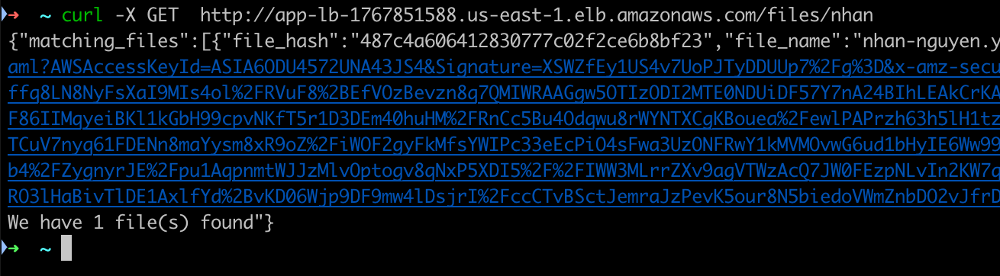

# Comprehensive Guide to Application Deployment and Infrastructure Setup Using Terraform and GitHub Actions


## Repository Overview
- **Codebase:** Contains the application code necessary for setting up the Flask API.
- **Infrastructure Code:** Located in the `infra` folder, this includes all Terraform files needed for setting up the entire infrastructure on AWS.

## Introduction
- **Overview:** This document outlines the steps to set up an application using Terraform and GitHub Actions, detailing each phase from the initial code fork to the final deployment checks.
- **Tools Explained:** Terraform is used for creating and managing infrastructure as code. GitHub Actions serves as the platform for continuous integration and deployment.

## Infrastructure Overview

### Application Framework

- **Flask Framework:** The application is built using Flask, a lightweight and flexible Python web framework ideal for creating RESTful APIs. Flask provides the necessary tools and libraries to develop a scalable and maintainable API service.

### Deployment and Hosting

- **AWS ECS:** The Flask application is containerized and deployed using AWS Elastic Container Service (ECS), which allows for the management, scaling, and running of containerized applications using Docker. ECS handles the lifecycle of the application from deployment to scaling.
  

### Traffic Management

- **Application Load Balancer (ALB):** An Application Load Balancer is used to distribute incoming API traffic across the various instances of the application running within ECS. The ALB enhances the availability and fault tolerance of the application.
  
- **DNS Configuration:** The domain name for accessing the API is managed through AWS Route 53, which points to the ALB, allowing users to access the API via a user-friendly URL instead of an IP address.

### Data Storage

- **Amazon S3:** All files uploaded through the API are stored in Amazon S3 buckets. S3 provides scalable, high-speed, web-based data storage infrastructure. It is used due to its durability, availability, and security features, which are suitable for storing user-generated content such as files and multimedia.
  
- **Data Management:** The application interacts with the S3 service to upload, retrieve, and delete files as requested by the API endpoints. Permissions and access to the S3 bucket are securely managed via AWS IAM (Identity and Access Management) roles that grant the ECS tasks the necessary rights to operate on the S3 bucket.

### Security and Compliance

- **Security Groups:** The ECS tasks and ALB are protected by AWS security groups which act as a virtual firewall, controlling the traffic allowed to and from the application and load balancer.

- **IAM Roles:** AWS IAM roles provide ECS tasks permissions to interact with AWS services securely, such as accessing the S3 bucket without needing to manage AWS access keys within the application.

### Monitoring and Maintenance

- **AWS CloudWatch:** Monitoring and logging are handled via AWS CloudWatch, which tracks metrics, collects logs, and sends alerts about the application and infrastructure's health and performance.

---

## Prerequisites
- GitHub account
- AWS account (for S3 and DynamoDB)
- Terraform installed on your local machine
- Git installed on your local machine

## Step 1: Fork the Codebase
- **Fork Repository:** Follow instructions to fork the necessary GitHub repository to your account.
- **Repository Link:** [GitHub Repository](https://github.com/nhannguyentrong/fileupload)

## Step 2: Clone the Repository
- **Clone Locally:** Use the following command to clone the repository to your local machine:
```
git clone (https://github.com/nhannguyentrong/fileupload)
```
- **Setup Directory:** Navigate into the cloned repository directory.

## Step 3: Set Up Terraform
- **Install Terraform:** Ensure Terraform is installed; if not, follow [these instructions](https://developer.hashicorp.com/terraform/tutorials/aws-get-started/install-cli).
- **Create S3 Bucket:** Steps to set up an S3 bucket for storing the Terraform state.
- **Setup DynamoDB:** Instructions for creating a DynamoDB table for state locking.
- Add this information to the `backend.tf` file


## Step 4: Update Terraform Variables
- **Tfvars File:** Editing the `infra/_tfvars/us-east-1.tfvars` file.
- **Variables Explanation:** All the key can keep as default, you have to update the last one, this is the `github_profile_url`. We need this for OIDC later. The format of this is `<github_username>/<reponame>`
```
#OIDC
github_profile_url = "nhannguyentrong/fileupload:*"
```

## Step 5: Execute Terraform Commands
- **Initialize Workspace:** Initialize the Terraform environment with:
```terraform init```
- **Plan Deployment:** Generate and review an execution plan using:
`terraform plan -var-file ./_tfvars/app/us-east-1.tfvars`
- **Apply Changes:** Apply the changes required to reach the desired state of the configuration:
`terraform apply -var-file ./_tfvars/app/us-east-1.tfvars`
The sample output like this
```
aws_lb_app_lb = "app-lb-1767851588.us-east-1.elb.amazonaws.com"
container_name = "app-api"
ecr_repository = "upload-file-api-repo"
ecs_cluster = "app_cluster"
ecs_service = "app_service"
github_assume_role = "arn:aws:iam::992382611445:role/github-actions-role"
task_name = "app-task"
```


The `aws_lb_app_lb` is the url to the application loadbalancer. We can use this for access to the application later.
## Step 6: Configure GitHub Actions
- **Set Environment Variables:** Add necessary environment variables in GitHub repository settings. Create new environment name `stage` with the following 


```
AWS_OIDC_ROLE_ASSUME = arn:aws:iam::992382611445:role/github-actions-role
AWS_REGION = us-west-1
CONTAINER_NAME = app-api
ECR_REPOSITORY = upload-file-api-repo
ECS_CLUSTER = app_cluster
ECS_SERVICE = app_service
TASK_NAME = app-task
```


## Step 7: Trigger the GitHub Actions Pipeline
- **Manual Trigger:** Instructions on how to manually trigger the pipeline, if necessary.
- **Pipeline Operations:** Explanation of the pipeline's functionalities upon execution.

## Step 8: Validate the Deployment
- **Deployment Check:** Steps to verify the correct deployment of the application.
- **Upload Command:** Use the following command to upload a file:

``curl -X POST -F "file=@path_to_your_file" http://app-lb-1767851588.us-east-1.elb.amazonaws.com/upload``


- **Retrieve File:** Command to retrieve the uploaded file and expected outputs.
```
curl -X GET http://app-lb-1767851588.us-east-1.elb.amazonaws.com/files/<file_name>
```

- **Delete File:** Command to delete the uploaded file and expected outputs.
```
curl -X DELETE http://app-lb-1767851588.us-east-1.elb.amazonaws.com/files/<file_hash>
```

## Step 8: API Overview

This step provides an overview of the API endpoints developed to manage file operations. Below is a table detailing the methods, parameters, and expected response formats for each endpoint:

| Endpoint                        | Method | Parameters                 | Description                          | Response Format        |
|---------------------------------|--------|----------------------------|--------------------------------------|------------------------|
| `domain_name/upload`            | POST   | File data (multipart/form) | Uploads a file to the server.        | ```{"file_hash":"file_hash","file_name":"file_name","message":"File uploaded successfully","presigned_url":"presigned_url"}``` |
| `domain_name/files/<file_name>` | GET    | File name                  | Retrieves the specified file.        | ```{"matching_files":[{"file_hash":"file_hash","file_name":"file_name","presigned_url":"presigned_url"}],"message":"We have 1 file(s) found"}```            |
| `domain_name/files/<hash_file>` | DELETE | File hash                  | Deletes the file with the given hash. | ```{"file_hash":"file_hash","message":"File deleted successfully","path":"path_to_file"}```    |

### Endpoint Descriptions

1. **POST `domain_name/upload`**
   - **Purpose:** This endpoint allows users to upload files to the server.
   - **Request Body:** The request should include the file data as multipart/form-data.
   - **Response:** The server returns a JSON object containing details about the uploaded file, such as file name, size, and a unique file identifier.

2. **GET `domain_name/files/<file_name>`**
   - **Purpose:** Retrieves a file based on its name.
   - **Parameters:** `file_name` – The name of the file to retrieve.
   - **Response:** The response is a json format, containt all the file math with file name, include the presigned_url, the user can use this link to download the file

3. **DELETE `domain_name/files/<hash_file>`**
   - **Purpose:** Deletes a file from the server using a hash identifier.
   - **Parameters:** `hash_file` – The hash of the file to delete.
   - **Response:** A JSON object indicating the success or failure of the delete operation, including any relevant error messages.


